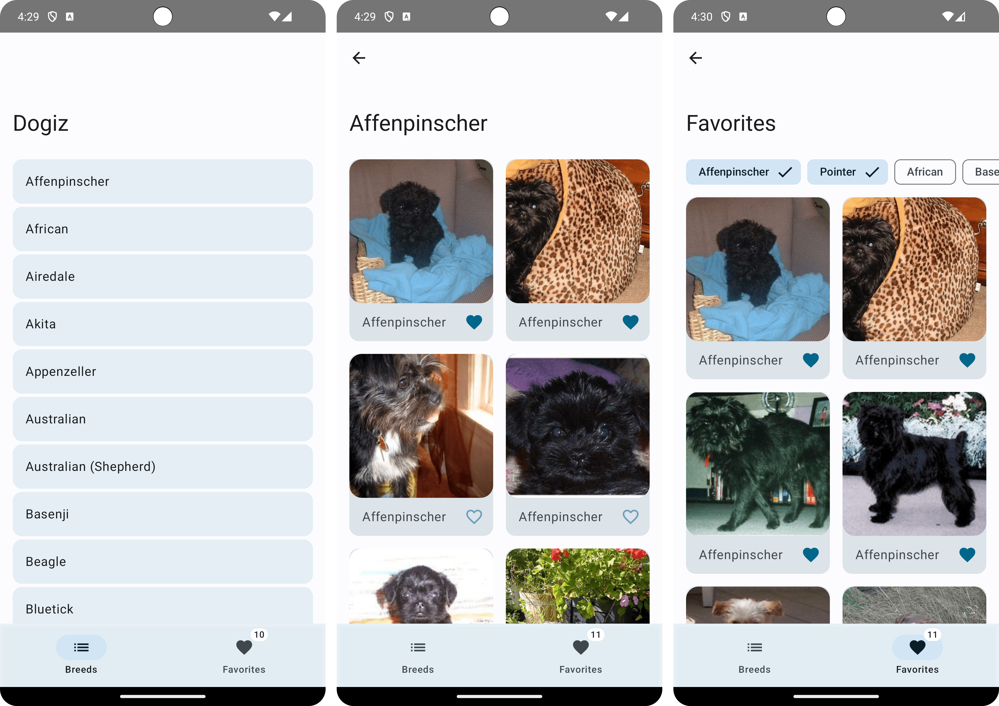

<h1 align="center">🐾🐶✨ Dogiz: A Contemporary Showcase of Android Development Using Kotlin, Jetpack Compose, Flow, and Clean Architecture.</h1>

  
  
  
  

Welcome to "Dogiz," your go-to example for modern Android development. Inspired
by [Now in Android](https://github.com/android/nowinandroid), we've simplified complex practices for
easy understanding and practical learning.

🎯 **Key Aspects**:

- 🏗️ **Clean Architecture**: A structured development approach.
- 📚 **Modern Libraries**: Kotlin Coroutines, Flow, Jetpack Compose, and more.
- 🧪 **Testing**: Ensuring robustness at every stage.
- 🔄 **CI/CD**: Efficient integration and deployment.

💡 Aligns with [Guide to App Architecture](https://developer.android.com/topic/architecture).

👨‍💻 **Who Should Use This?**
Anyone keen to dive into modern Android development—Dogiz is your guide!

## Screenshots

## 🧱 Clean Architecture in Android with Kotlin

### Clean Architecture in Android prioritizes:

- 🎯 **Distinct Roles**: Unique purpose for each layer.
- 🔒 **Layer Autonomy**: Pure Kotlin/Java in core layers.
- 🧪 **Testability**: Fostering reliability.
- 🚀 **Adaptive Design**: Ready for tech shifts and requirements.

#### The Three Layers

- **UI Layer**: Interactive & visually captivating.
- **Domain Layer**: The business logic hub.
- **Data Layer**: Manages all data sources.

##### 🎨 The UI Layer

Here's a look at the tools and practices shaping the UI:

- 🎨 **Jetpack Compose**: For a modern, declarative UI.
- 🗃️ **ViewModels**: Acting as state holders.
- 🌊 **Kotlin Flow & StateFlow**: For data streams and state management.

##### 💼 The Domain Layer

The domain layer is the backbone:

- 📚 **Pure Kotlin**: For a platform-agnostic core.
- ⚙️ **Use Cases**: Distinct operations encapsulating business rules.
- 🧪 **Unit Testing**: For validating each use case.
- 🚀 **Decoupling**: Ensuring stability and consistency.

##### 💾 The Data Layer

The data layer stands as a pivotal component:

- 🗂️ **Repository Pattern**: For clean data access.
- 🌐 **Ktor**: Handling API calls.
- 📦 **Room**: Local data storage.

---

## 🍃 Functional Programming with Kotlin Flow

We bring functional programming into play:

- 🧮 **Pure Functions**: For predictable, testable behavior.
- 🔒 **Immutable Data**: Minimizing potential bugs.
- 🌊 **Kotlin Flow Integration**: For handling asynchronous data streams.

---

## 💉 Hilt: Elevating Dependency Management

Hilt takes dependency management to the next level:

- 🎯 **Simplified Injection**: Automated dependency management.
- 📦 **Modularity**: For easy scaling.
- 🕒 **Scoped Components**: Aligned with Android's architecture components.

---

### 🖌️🎨 UX/UI Considerations

- 🌐 **Offline Handling**: Friendly alerts and cached data ensure smooth usage, even without a
  connection.
- 💾 **Data Persistence**: From user preferences to dog breed details, we save the essentials for
  offline access.
- ⚠️ **Clear Error Feedback**: We've got you covered with clear error messages and alerts.

---

### 🛠️ Libraries & Tools

"Dogiz" incorporates the latest libraries and tools:

- **Kotlin Coroutines**: For efficient asynchronous programming.
  -**Kotlin Flow**: Managing async data streams.
- **Hilt**: For injecting dependencies.
- **Ktor Client**: Handling APIs.
- **Jetpack Compose & Navigation-Compose**: Crafting UI & navigation.
- **Material 3**: Modern UI aesthetics.
- **Kotlin Serialization**: Parsing data.
- **Coil-Compose**: Loading images.
- **Room**: Local database management.
- **DataStore Core**: Storing preferences locally.

---

## 🤝 Feedback and Contributions

"Dogiz" is more than just an app—it's a showcase for the community! As we continue to refine and
expand, your insights, expertise, and contributions can play a crucial role.

🚧 **Work in Progress**: We're tirelessly enhancing features and functionalities. Your patience and
suggestions are greatly appreciated!

👐 **Contribute**: Spotted an area for improvement? Have a feature idea? Open an issue to discuss or,
even better, submit a pull request to make "Dogiz" even more robust.

🙏 We deeply value the power of community collaboration. Let's shape "Dogiz" together!

---

